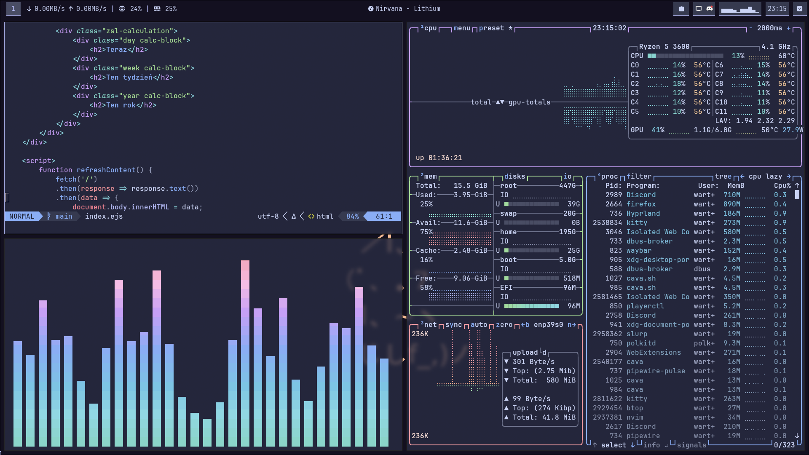
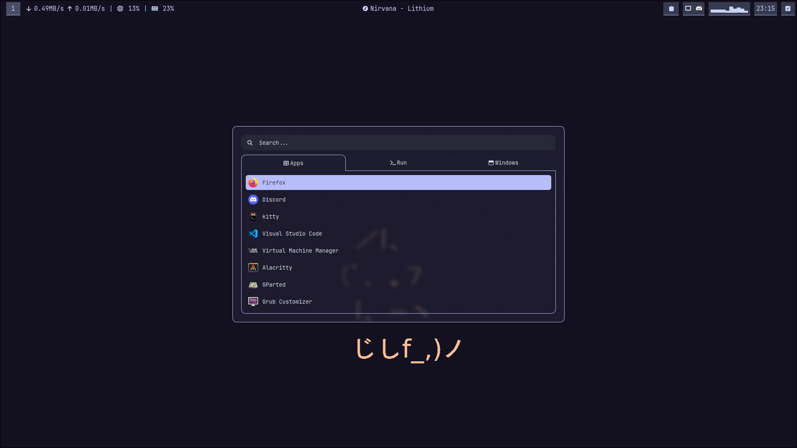
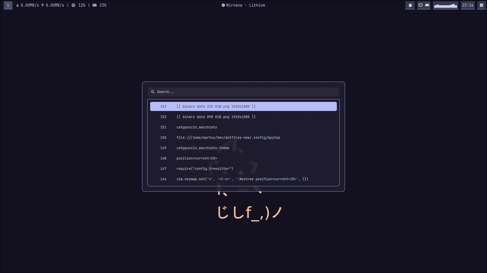

# Dotfiles

My personal dotfiles used for my Linux systems.

## Preview





## Installation

```bash
git clone https://github.com/wartuu/dotfiles && cd dotfiles
stow -t ~/ .
```

## Used themes

- [Catppuccin](https://github.com/catppuccin)
- [Catppuccin GTK theme](https://github.com/Fausto-Korpsvart/Catppuccin-GTK-Theme)
- [rofi config](https://github.com/adi1090x/rofi)
- [Tela icons](https://github.com/vinceliuice/Tela-icon-theme)
